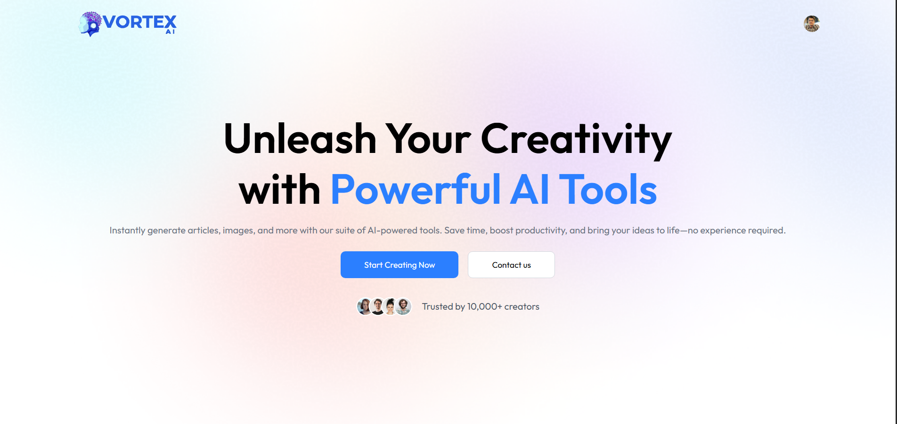

# 🚀 Vortex AI - Unleash Your Creativity with Powerful AI Tools

<div align="center">
  
  
  
  
  
  

  
  **Instantly generate articles, images, and more with our suite of AI-powered tools. Save time, boost productivity, and bring your ideas to life—no experience required.**
  
  [🌟 Live Demo](https://vortexai.risshi.me)  • [🐛 Report Bug](https://github.com/coder-writes/vortex-ai/issues)
</div>

---

## ✨ Features

### 🎨 **AI-Powered Content Creation**
- **📝 Article Writer** - Generate high-quality articles with AI assistance
- **🖼️ Image Generation** - Create stunning images from text descriptions
- **📰 Blog Title Generator** - Generate catchy and SEO-friendly blog titles
- **📄 Resume Review** - AI-powered resume analysis and feedback

### 🛠️ **Advanced AI Tools**
- **🎭 Background Removal** - Remove backgrounds from images instantly
- **🔧 Object Removal** - Remove unwanted objects from photos
- **👥 Community Hub** - Share and discover AI-generated content
- **📊 Dashboard** - Track your creations and usage statistics

### 🔐 **User Experience**
- **🔒 Secure Authentication** - Powered by Clerk
- **📱 Responsive Design** - Perfect on all devices
- **⚡ Real-time Processing** - Fast AI-powered operations
- **🎨 Modern UI/UX** - Clean, intuitive interface

---

## 🛠️ Tech Stack

### **Frontend**
| Technology | Version | Purpose |
|------------|---------|---------|
| **React** | 19.1.0 | Frontend framework |
| **Vite** | Latest | Build tool and dev server |
| **Tailwind CSS** | Latest | Utility-first CSS framework |
| **React Router** | 7.7.0 | Client-side routing |
| **Lucide React** | 0.525.0 | Beautiful icons |
| **Lottie React** | 0.14.4 | Smooth animations |

### **Backend**
| Technology | Version | Purpose |
|------------|---------|---------|
| **Node.js** | Latest | Runtime environment |
| **Express.js** | 5.1.0 | Web framework |
| **Google Generative AI** | 0.24.1 | Additional AI capabilities |
| **Cloudinary** | 2.7.0 | Image processing and storage |
| **Neon Database** | 1.0.1 | PostgreSQL database |

### **Authentication & Security**
| Technology | Version | Purpose |
|------------|---------|---------|
| **Clerk** | 5.35.3 | User authentication |
| **Express Clerk** | 1.7.13 | Backend authentication |
| **CORS** | 2.8.5 | Cross-origin resource sharing |

---

## 🚀 Quick Start

### Prerequisites
- **Node.js** (v18 or higher)
- **npm** or **yarn**
- **OpenAI API Key**
- **Clerk Account**
- **Cloudinary Account**
- **Neon Database** (PostgreSQL)

### 1️⃣ Clone the Repository
```bash
git clone https://github.com/coder-writes/vortex-ai.git
cd vortex-ai
```

### 2️⃣ Install Dependencies

**Client Setup:**
```bash
cd cilent
npm install
```

**Server Setup:**
```bash
cd ../server
npm install
```

### 3️⃣ Environment Configuration

**Client (.env):**
```env
VITE_BASE_URL=http://localhost:4000
VITE_CLERK_PUBLISHABLE_KEY=your_clerk_publishable_key
```

**Server (.env):**
```env
PORT=4000
CLERK_SECRET_KEY=your_clerk_secret_key
OPENAI_API_KEY=your_openai_api_key
GOOGLE_API_KEY=your_google_api_key
CLOUDINARY_CLOUD_NAME=your_cloudinary_cloud_name
CLOUDINARY_API_KEY=your_cloudinary_api_key
CLOUDINARY_API_SECRET=your_cloudinary_api_secret
DATABASE_URL=your_neon_database_url
```

### 4️⃣ Run the Application

**Start the Backend Server:**
```bash
cd server
npm run server
```

**Start the Frontend (New Terminal):**
```bash
cd cilent
npm run dev
```

🎉 **Visit** `http://localhost:5173` **to see your app in action!**

---

## 📁 Project Structure

```
vortex-ai/
├── 📂 cilent/                 # Frontend React application
│   ├── 📂 public/             # Static assets
│   ├── 📂 src/
│   │   ├── 📂 components/     # Reusable components
│   │   │   ├── AiTools.jsx
│   │   │   ├── Hero.jsx
│   │   │   ├── Navbar.jsx
│   │   │   └── Footer.jsx
│   │   ├── 📂 pages/          # Page components
│   │   │   ├── Dashboard.jsx
│   │   │   ├── GenerateImages.jsx
│   │   │   ├── WriteArticle.jsx
│   │   │   ├── ReviewResume.jsx
│   │   │   ├── Community.jsx
│   │   │   └── ContactUs.jsx
│   │   ├── 📂 assets/         # Images and static files
│   │   └── App.jsx            # Main app component
│   └── package.json
├── 📂 server/                 # Backend Node.js application
│   ├── 📂 configs/            # Configuration files
│   │   ├── cloudinary.js
│   │   ├── db.js
│   │   └── multer.js
│   ├── 📂 controllers/        # Route controllers
│   │   ├── aiController.js
│   │   └── userController.js
│   ├── 📂 middlewares/        # Custom middlewares
│   │   └── auth.js
│   ├── 📂 routes/             # API routes
│   │   ├── aiRoute.js
│   │   └── userRoute.js
│   ├── server.js              # Main server file
│   └── package.json
└── README.md
```

---

## 🎨 Features Showcase

### 🖼️ **AI Image Generation**
Generate stunning images from simple text descriptions using advanced AI models.

### 📝 **Smart Article Writing**
Create well-structured, engaging articles with AI assistance. Perfect for bloggers and content creators.

### 📄 **Resume Analysis**
Upload your resume and get detailed feedback on improvements, formatting, and content optimization.

### 👥 **Community Platform**
Share your AI-generated content, discover creations from other users, and get inspired.

### 🎭 **Image Editing Tools**
- Remove backgrounds with one click
- Remove unwanted objects from photos
- Professional-quality results

---

## 🔧 API Endpoints

### **AI Generation Routes**
```
POST /api/ai/generate-image      # Generate images from text
POST /api/ai/write-article       # Generate articles
POST /api/ai/generate-titles     # Generate blog titles
POST /api/ai/review-resume       # Analyze resumes
POST /api/ai/remove-background   # Remove image backgrounds
POST /api/ai/remove-object       # Remove objects from images
```

### **User Management Routes**
```
GET  /api/user/get-published-creations  # Get user's public creations
POST /api/user/toggle-like-creation     # Like/unlike content
GET  /api/user/dashboard-stats          # Get user statistics
```

---

## 🚀 Deployment

### **Frontend (Vercel)**
```bash
cd cilent
npm run build
# Deploy to Vercel using vercel.json configuration
```

### **Backend (Railway/Heroku)**
```bash
cd server
npm start
# Deploy using your preferred platform
```

### **Environment Variables**
Make sure to set all required environment variables in your deployment platform:
- Clerk keys for authentication
- OpenAI API key for AI features
- Cloudinary credentials for image processing
- Database connection string

---

## 🤝 Contributing

We love contributions! Here's how you can help:

1. **🍴 Fork** the repository
2. **🌿 Create** a feature branch (`git checkout -b feature/amazing-feature`)
3. **💾 Commit** your changes (`git commit -m 'Add amazing feature'`)
4. **📤 Push** to the branch (`git push origin feature/amazing-feature`)
5. **🔄 Open** a Pull Request

### **Development Guidelines**
- Follow the existing code style
- Add comments for complex logic
- Test your changes thoroughly
- Update documentation if needed

---

## 📄 License

This project is licensed under the **ISC License** - see the [LICENSE](LICENSE) file for details.

---

## 🙏 Acknowledgments

- **OpenAI** for providing powerful AI models
- **Google** for Generative AI capabilities
- **Clerk** for seamless authentication
- **Cloudinary** for image processing
- **Neon** for database hosting
- **Vercel** for frontend hosting

---

## 📞 Support & Contact

<div align="center">
  
### **Need Help?**

📧 **Email:** [vortex@risshi.me](mailto:vortex@risshi.me)  
🐛 **Issues:** [GitHub Issues](https://github.com/coder-writes/vortex-ai/issues)  
💬 **Discussions:** [GitHub Discussions](https://github.com/coder-writes/vortex-ai/discussions)  

### **Connect With Us**

[](https://github.com/coder-writes)
[](https://linkedin.com/in/rishi-verma-sde)
[](https://twitter.com/risshi-codes)
[](https://risshi.me)

</div>

---

<div align="center">
  <h3>⭐ Star this project if you find it helpful!</h3>
  
  **Made with ❤️ by [Vortex AI Team](https://github.com/coder-writes)**
  
  
</div>